My name is Siya Kamboj. I'm a rising 4th year CS student @ UCSD. Currently, I'm an Undergraduate Researcher and Project lead at [UCSD's Engineers for Exploration Lab](https://e4e.ucsd.edu/).

### Languages


### Development Frameworks


 <!-- unofficial -->

 <!-- unofficial -->


### Databases
 <!-- unofficial -->
 <!-- unofficial -->


### Data Science & AI/ML
#### Data Preprocessing & Visualization


 <!-- uses Python logo, no official seaborn icon -->

#### AI/ML Models & Architectures


### Full Stack Projects

[](https://github.com/UCSD-E4E/pyrenote-desk)
[](https://github.com/SiyaKamboj/Membership-Dashboard)
[](https://github.com/SiyaKamboj/Receipt-Reader)
[](https://github.com/getmagic/getmagic.github.io)

### ML Projects
[](https://github.com/acmucsd-projects/fa22-ai-team-3)
[](https://github.com/UCSD-E4E/pyha-analyzer-2.0)


### Languages & GitHub Usage


### Contact
<a href="https://www.linkedin.com/in/siya-kamboj-5b6334232/">
  
</a>
<a href="mailto:siyakamboj20@gmail.com">
  
</a>


<!-- ```yaml
name: Siya Kamboj
located_in: Hayward, CA
current_job: Undergraduate Researcher at UCSD's Engineers for Exploration lab
education:
  [
    "Self-Taught Developer and Designer",
    "Master's in Electrical and Computer Engineering",
    "Bachelor's in Electronics and Communication",
  ]

fields_of_interests:
  [
    "Web Development",
    "Data Science",
    "Machine Learning",
    "UI/UX",
    "Game Development",
    "DevOps",
  ]
technical_background:
  [
    "Full Stack Developer"
    "DevOps Solutions Architect",
    "Intern - Data Science & Machine Learning in Python",
    "Intern - Internet Of Things",
    "Intern - VLSI and FPGA Implementation",
  ]
  
currently_learning: ["Docker, Kubernetes, and React Native"]
2024 Goals: ["Create 25+ Projects and learn at least 5-10 new Technologies."]
hobbies: ["Gaming", "Cinema", "Skateboarding", "Art", "Comedy"]
``` -->


<!-- ### 🛠 Languages and Tools

[](https://github.com/SiyaKamboj) -->


<!--
**SiyaKamboj/SiyaKamboj** is a ✨ _special_ ✨ repository because its `README.md` (this file) appears on your GitHub profile.

Here are some ideas to get you started:

- 🔭 I’m currently working on ...
- 🌱 I’m currently learning ...
- 👯 I’m looking to collaborate on ...
- 🤔 I’m looking for help with ...
- 💬 Ask me about ...
- 📫 How to reach me: ...
- 😄 Pronouns: ...
- ⚡ Fun fact: ...
-->
